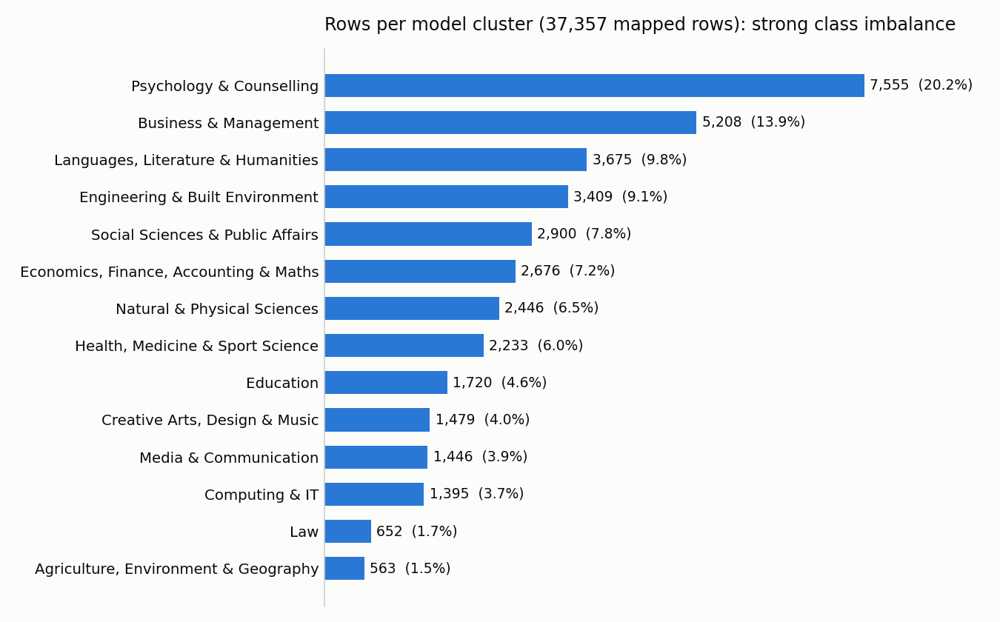
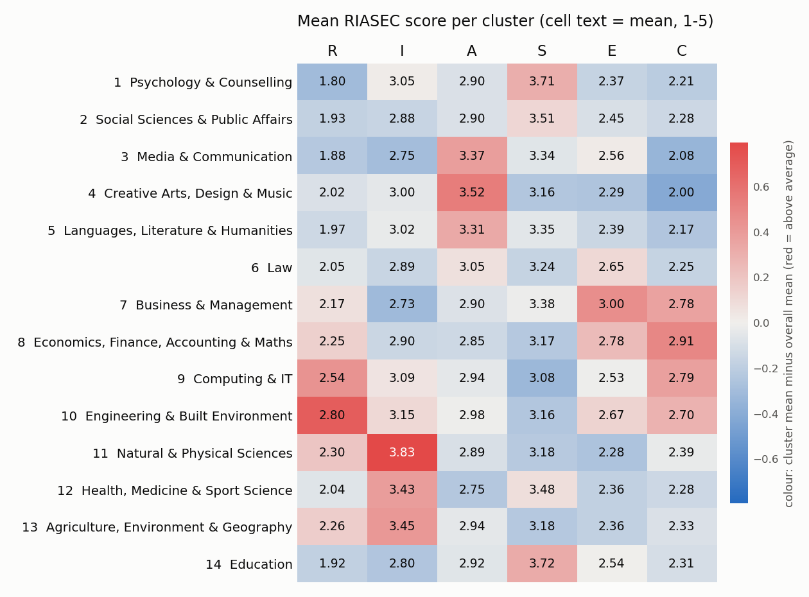

# 03 - Mapping majors to 14 interest-based model clusters

Code: `notebooks/03_cluster_mapping.ipynb` (rerun top to bottom; needs the SSL workaround on this PC).
Config (the source of truth for every mapping decision): `config/major_to_cluster.csv`, `config/keyword_rules.csv`, `config/model_clusters.csv`.
Outputs: `processed/riasec_labelled.csv` (the clean rows that received a cluster), `processed/major_mapping_full.csv` (every distinct major and its result), charts in `notes/figures/`.
`riasec_clean.csv` and `data.csv` were not modified (checksum checked). Nothing was uploaded. Seed 42 is set (nothing random is used).
**Not done, by your instruction:** no train/test split and no model.

## Summary

- **37,357 of the 41,947 clean rows (89.1%) now have a cluster**; 4,590 (10.9%) are dropped, each with a recorded reason.
- **This version includes your review decisions (Oct 2026):** 95 rows moved into Education, 19 rows newly mapped, 3 newly dropped. See "Changes after your review" below.
- 300 majors were hand-mapped (together 80.8% of rows; 79.6% of rows got a cluster from the hand table), and keyword rules map another 9.5%.
- Every cluster has at least 485 test-eligible rows, so **no cluster falls under your 300 threshold**. The smallest are Agriculture, Environment & Geography (485) and Law (580).
- **Class imbalance is strong:** Psychology & Counselling is 20.2% of mapped rows, Agriculture only 1.5% (13 to 1).
- **Profile sanity check:** 7 of 14 clusters match the expected RIASEC profile, 6 are weak, and 1 does not match (Economics, Finance, Accounting & Maths). Details and what it means for the model are in section 6.
- **Baselines to beat:** always guessing Psychology gives 20.2% top-1; always returning the three biggest clusters gives 44.0% top-3.

## Changes after your review (Oct 2026)

Applied exactly as decided:
1. **Subject-teaching degrees go to 14 Education** (music, english, art and business education, plus variants such as "visual art education"); marked `confident = yes` with the note "Kenyan subject-teaching degrees are B.Ed programmes (KUCCPS cluster 19)". "Educational psychology" and "physical education" were already 14.
2. **"computer science and engineering" goes to 9**, consistent with "computer science engineering" (a new `phrase` rule, so it also works written with "&").
3. **New rule: "i o psychology" / "industrial organizational psychology" go to 1** (also "I/O psychology", "I-O psychology", "industrial and organisational psychology").
4. **Clusters 7 and 8 kept separate.**
5. Everything else in the review list kept as is.
6. KUCCPS wording in section 1 updated.

**Result: 117 rows changed.** 95 rows moved between clusters (57 from Creative Arts, 25 from Languages/Literature/Humanities, 13 from Business, all into Education), 19 rows were newly mapped, and 3 rows were newly dropped. Mapped rows went from 37,341 to 37,357 (+16); dropped from 4,606 to 4,590. The test run now has 42 rule tests (10 new), all passing, and `riasec_clean.csv` is unchanged.

Rows moved between clusters:

| Major (normalised) | Rows | From | To |
|---|---|---|---|
| music education | 41 | 4 Creative Arts, Design & Music | 14 Education |
| english education | 23 | 5 Languages, Literature & Humanities | 14 Education |
| art education | 14 | 4 Creative Arts, Design & Music | 14 Education |
| business education | 13 | 7 Business & Management | 14 Education |
| english education drama | 1 | 5 Languages, Literature & Humanities | 14 Education |
| english education library science | 1 | 5 Languages, Literature & Humanities | 14 Education |
| music education and clarinet performance | 1 | 4 Creative Arts, Design & Music | 14 Education |
| visual art education | 1 | 4 Creative Arts, Design & Music | 14 Education |

Newly mapped (previously dropped):

| Major (normalised) | Rows | From | To |
|---|---|---|---|
| computer science and engineering | 7 | dropped | 9 Computing & IT |
| i o psychology | 7 | dropped | 1 Psychology & Counselling |
| i o psych | 1 | dropped | 1 Psychology & Counselling |
| industrial and organisational psychology | 1 | dropped | 1 Psychology & Counselling |
| industrial and organizational psychology | 1 | dropped | 1 Psychology & Counselling |
| industrial organizational psychology | 1 | dropped | 1 Psychology & Counselling |
| studying i o psychology | 1 | dropped | 1 Psychology & Counselling |

Newly dropped (a side effect: these multi-major strings used to be mapped to Creative Arts because "art education" / "music education" counted as Creative Arts; now the parts disagree):

| Major (normalised) | Rows | From | To |
|---|---|---|---|
| art art education | 1 | 4 Creative Arts, Design & Music | dropped |
| art education and art history | 1 | 4 Creative Arts, Design & Music | dropped |
| music theory music education | 1 | 4 Creative Arts, Design & Music | dropped |

Per-cluster counts, before and after:

| Cluster | Rows before | Rows after | Change | Test-eligible before | Test-eligible after | Change  | % of mapped after |
|---|---|---|---|---|---|---|---|
| 1 Psychology & Counselling | 7,543 | 7,555 | +12 | 6,181 | 6,192 | +11 | 20.2 |
| 2 Social Sciences & Public Affairs | 2,900 | 2,900 | +0 | 2,406 | 2,406 | +0 | 7.8 |
| 3 Media & Communication | 1,446 | 1,446 | +0 | 1,225 | 1,225 | +0 | 3.9 |
| 4 Creative Arts, Design & Music | 1,539 | 1,479 | -60 | 1,344 | 1,294 | -50 | 4.0 |
| 5 Languages, Literature & Humanities | 3,700 | 3,675 | -25 | 3,224 | 3,203 | -21 | 9.8 |
| 6 Law | 652 | 652 | +0 | 580 | 580 | +0 | 1.7 |
| 7 Business & Management | 5,221 | 5,208 | -13 | 4,095 | 4,083 | -12 | 13.9 |
| 8 Economics, Finance, Accounting & Maths | 2,676 | 2,676 | +0 | 2,149 | 2,149 | +0 | 7.2 |
| 9 Computing & IT | 1,388 | 1,395 | +7 | 1,161 | 1,167 | +6 | 3.7 |
| 10 Engineering & Built Environment | 3,409 | 3,409 | +0 | 2,783 | 2,783 | +0 | 9.1 |
| 11 Natural & Physical Sciences | 2,446 | 2,446 | +0 | 2,090 | 2,090 | +0 | 6.5 |
| 12 Health, Medicine & Sport Science | 2,233 | 2,233 | +0 | 1,891 | 1,891 | +0 | 6.0 |
| 13 Agriculture, Environment & Geography | 563 | 563 | +0 | 485 | 485 | +0 | 1.5 |
| 14 Education | 1,625 | 1,720 | +95 | 1,314 | 1,394 | +80 | 4.6 |
| **Total mapped** | 37,341 | 37,357 | +16 | 30,928 | 30,942 | +14 | 100.0 |

**Baselines (almost unchanged):**

| Rows used | Top-1 before | Top-1 after | Top-3 before | Top-3 after |
|---|---|---|---|---|
| All mapped rows | 20.20% (n = 37,341) | **20.22%** (n = 37,357) | 44.09% | **44.00%** |
| Test-eligible rows only | 19.99% (n = 30,928) | **20.01%** (n = 30,942) | 43.65% | **43.56%** |

The always-guess clusters are the same as before (Psychology; Psychology + Business + Languages/Literature/Humanities).
**Profile check:** unchanged (7 match, 6 weak, 1 does not match). The largest shift in any cluster's mean RIASEC score is 0.03, in Education (A +0.03), so the heatmap looks the same.
**Test-eligible counts:** Education 1,394 (+80), Creative Arts 1,294 (-50), Languages/Literature/Humanities 3,203 (-21), Business & Management 4,083 (-12), Computing 1,167 (+6), Psychology 6,192 (+11). The smallest cluster is still Agriculture with 485, so **no cluster is under 300 test-eligible rows**.
**One open question** is in section 8, item 4 (58 rows of other "<subject> education" strings still dropped as conflicts).

## 1. Why 14 model clusters, not the 20 KUCCPS clusters

KUCCPS groups degrees by **KCSE entry requirements, not by interests**. For example, KUCCPS cluster 3 combines psychology, journalism and fine arts, which have very different RIASEC profiles.
The model learns from RIASEC interest scores, so it needs classes whose members share an interest pattern. We therefore use **14 interest-based model clusters**, and a separate table (below) maps each one back to its KUCCPS clusters for the eligibility step.
Small KUCCPS clusters (French/German, geosciences, sport science, etc.) are merged into larger model clusters because they have too few rows to learn from.
KUCCPS cluster numbers checked against the published list of the 20 KUCCPS degree clusters (Oct 2026).

| id | Model cluster | KUCCPS clusters it maps back to |
|---|---|---|
| 1 | Psychology & Counselling | 3 |
| 2 | Social Sciences & Public Affairs | 3, 14 |
| 3 | Media & Communication | 3 |
| 4 | Creative Arts, Design & Music | 3, 11, 18 |
| 5 | Languages, Literature & Humanities | 14, 17, 20, 3 |
| 6 | Law | 1 |
| 7 | Business & Management | 2 |
| 8 | Economics, Finance, Accounting & Maths | 10 |
| 9 | Computing & IT | 7 |
| 10 | Engineering & Built Environment | 5, 6 |
| 11 | Natural & Physical Sciences | 9, 4 |
| 12 | Health, Medicine & Sport Science | 13, 12, 15 |
| 13 | Agriculture, Environment & Geography | 8, 15, 16 |
| 14 | Education | 19 |

## 2. How the mapping works

1. **Hand table.** The 300 most common normalised majors (about 81% of rows) are mapped by hand in `config/major_to_cluster.csv` with a `confident` flag (yes/no) and a note.
   286 map to a cluster. 14 are **deliberately left unmapped**: 7 vague (liberal arts, general studies, arts, liberal studies, interdisciplinary studies, general, general education), 3 that are two fields in different clusters (psychology and sociology, psychology sociology, psychology and criminology) and 4 I could not place without guessing (`UNMAPPED_AMBIGUOUS`: library science, recreation, technology, telecommunications).
2. **Keyword rules** (`config/keyword_rules.csv`, 35 rules, in priority order; the matching rule is stored as `keyword:<rule>`).
   - *vague* rules drop broad strings (general studies, liberal arts, arts, ba, aa, and similar).
   - *phrase* rules are whole-string names that contain "and" in the name itself, so they are tried before the multi-major split: "computer science and engineering" (also written "&" or without "and") goes to 9, and "I/O psychology" / "industrial and organizational psychology" go to 1.
   - *override* rules are other specific phrases tried first: educational psychology goes to 14, law enforcement to 2, veterinary anything to 12, biomedical engineering to 10 (through the engineer rule), "it" to 9, public administration to 2, and subject-teaching degrees (music, art, english and business education) to 14, because in Kenya they are B.Ed programmes (KUCCPS cluster 19).
   - *multi-major strings* (containing `,` `/` `&` `+` `;` or "and") are split. If every part lands in the same cluster the string is mapped (e.g. "accounting and finance"); if the parts land in different clusters it is dropped (`UNMAPPED_MULTI`). If a part cannot be mapped, the phrase rules get one more try on the whole string first, so single names that contain "and" (e.g. "communication sciences and disorders") still work.
   - the *strong* rule `engineer` outranks the general rules.
   - *general* rules are keywords such as "nurs", "psych", "account", "teach". **If a string matches general rules from two different clusters (e.g. "psychology education") it is dropped as `UNMAPPED_CONFLICT`.**
3. **Everything else** is unmapped and dropped (`UNMAPPED_NO_RULE`).
4. **Tests.** The notebook runs 42 test cases of your rulings through the *keyword engine alone* (hand table switched off) and all pass: educational psychology to 14, law enforcement to 2, biomedical engineering to 10, veterinary to 12, it to 9, accounting and finance to 8, computer science and engineering to 9, I/O psychology to 1, music/english/art/business education to 14, social science to 2, the vague list, and more.
5. **Cross-check against my hand mapping.** For the 286 hand-mapped strings that received a cluster, the keyword engine alone gives the same cluster for 272 (95%), a different cluster for 3 (information management, mental health, clinical mental health; all marked "not confident"), and drops 11 (e.g. "science", "human development", "child development", which have no keyword rule).

## 3. Coverage

| Outcome | Rows | % of the 41,947 clean rows |
|---|---|---|
| Mapped: hand table (top 300 majors) | 33,373 | 79.6% |
| Mapped: keyword rule | 3,404 | 8.1% |
| Mapped: keyword rule, multi-major string whose parts are all in one cluster | 580 | 1.4% |
| **Total mapped** | **37,357** | **89.1%** |
| Unmapped: UNMAPPED_VAGUE | 447 | 1.1% |
| Unmapped: UNMAPPED_MULTI | 2,129 | 5.1% |
| Unmapped: UNMAPPED_CONFLICT | 453 | 1.1% |
| Unmapped: UNMAPPED_AMBIGUOUS | 56 | 0.1% |
| Unmapped: UNMAPPED_NO_RULE | 1,505 | 3.6% |
| **Total unmapped (dropped)** | **4,590** | **10.9%** |

Of the dropped `UNMAPPED_MULTI` rows, 1,331 are strings where every part mapped but to different clusters (genuinely two fields, e.g. "psychology and sociology"), 758 have at least one part the rules could not map, and 40 were hand-marked.

What is in the dropped groups:
- **UNMAPPED_NO_RULE (1,505 rows, 1,155 distinct strings):** a very flat tail; the largest are only 6-10 rows each (human relations, sport, information science, social, forensic science, forensics, sports, material science, information studies, planning, bioinformatics, mechanics). No single missing rule would recover more than about 10 rows.
- **UNMAPPED_CONFLICT (453 rows, 286 strings):** cross-field strings such as communication design, business economics, financial management, health care management, counselor education, health education.
- **UNMAPPED_MULTI:** genuinely two-field strings such as psychology and sociology (18), psychology sociology (12), english psychology (10), biology and psychology (10), psychology and criminology (10), psychology education (8), psychology and business (8), and "library and information science" (6).
- **UNMAPPED_VAGUE (447 rows):** liberal arts 120, general studies 97, arts 82, liberal studies 54, interdisciplinary studies 25, general 22, general education 17, ba 7, and a few others.

## 4. Rows per cluster (class balance)

Test-eligible = the record was the only one from its network location (step 02). Percentages are of the 37,357 mapped rows (and of all 41,947 clean rows).

| id | Cluster | Rows | % of mapped | % of all clean | Test-eligible | Flag |
|---|---|---|---|---|---|---|
| 1 | Psychology & Counselling | 7,555 | 20.2 | 18.0 | 6,192 | ok |
| 2 | Social Sciences & Public Affairs | 2,900 | 7.8 | 6.9 | 2,406 | ok |
| 3 | Media & Communication | 1,446 | 3.9 | 3.4 | 1,225 | ok |
| 4 | Creative Arts, Design & Music | 1,479 | 4.0 | 3.5 | 1,294 | ok |
| 5 | Languages, Literature & Humanities | 3,675 | 9.8 | 8.8 | 3,203 | ok |
| 6 | Law | 652 | 1.7 | 1.6 | 580 | ok |
| 7 | Business & Management | 5,208 | 13.9 | 12.4 | 4,083 | ok |
| 8 | Economics, Finance, Accounting & Maths | 2,676 | 7.2 | 6.4 | 2,149 | ok |
| 9 | Computing & IT | 1,395 | 3.7 | 3.3 | 1,167 | ok |
| 10 | Engineering & Built Environment | 3,409 | 9.1 | 8.1 | 2,783 | ok |
| 11 | Natural & Physical Sciences | 2,446 | 6.5 | 5.8 | 2,090 | ok |
| 12 | Health, Medicine & Sport Science | 2,233 | 6.0 | 5.3 | 1,891 | ok |
| 13 | Agriculture, Environment & Geography | 563 | 1.5 | 1.3 | 485 | ok |
| 14 | Education | 1,720 | 4.6 | 4.1 | 1,394 | ok |

**No cluster has fewer than 300 test-eligible rows** (smallest: Agriculture, Environment & Geography 485, Law 580).
Imbalance: Psychology & Counselling is 7,555 rows against 563 for Agriculture. A random stratified split by cluster will work, but a classifier trained as-is will lean towards the large clusters, so plan for class weights or similar, and judge it with per-cluster metrics, not just accuracy.

## 5. Baselines: always guess the biggest cluster(s)

| Rows used | Top-1: always "Psychology & Counselling" | Top-3: always Psychology, Business & Management, Languages/Literature/Humanities |
|---|---|---|
| All mapped rows (37,357) | **20.2%** | **44.0%** |
| Test-eligible rows only (30,942) | 20.0% | 43.6% |
| For reference: uniform random guessing among 14 | 7.1% | 21.4% |

A model is only useful if it clearly beats 20% top-1 and 44% top-3.

## 6. Mean RIASEC profile per cluster (sanity check)

Mean score of each scale (1-5) for the mapped rows of each cluster. The overall mean of all mapped rows is R 2.11, I 3.04, A 2.98, S 3.40, E 2.54, C 2.42.

| Cluster | R | I | A | S | E | C |
|---|---|---|---|---|---|---|
| 1 Psychology & Counselling | 1.8 | 3.05 | 2.9 | 3.71 | 2.37 | 2.21 |
| 2 Social Sciences & Public Affairs | 1.93 | 2.88 | 2.9 | 3.51 | 2.45 | 2.28 |
| 3 Media & Communication | 1.88 | 2.75 | 3.37 | 3.34 | 2.56 | 2.08 |
| 4 Creative Arts, Design & Music | 2.02 | 3.0 | 3.52 | 3.16 | 2.29 | 2.0 |
| 5 Languages, Literature & Humanities | 1.97 | 3.02 | 3.31 | 3.35 | 2.39 | 2.17 |
| 6 Law | 2.05 | 2.89 | 3.05 | 3.24 | 2.65 | 2.25 |
| 7 Business & Management | 2.17 | 2.73 | 2.9 | 3.38 | 3.0 | 2.78 |
| 8 Economics, Finance, Accounting & Maths | 2.25 | 2.9 | 2.85 | 3.17 | 2.78 | 2.91 |
| 9 Computing & IT | 2.54 | 3.09 | 2.94 | 3.08 | 2.53 | 2.79 |
| 10 Engineering & Built Environment | 2.8 | 3.15 | 2.98 | 3.16 | 2.67 | 2.7 |
| 11 Natural & Physical Sciences | 2.3 | 3.83 | 2.89 | 3.18 | 2.28 | 2.39 |
| 12 Health, Medicine & Sport Science | 2.04 | 3.43 | 2.75 | 3.48 | 2.36 | 2.28 |
| 13 Agriculture, Environment & Geography | 2.26 | 3.45 | 2.94 | 3.18 | 2.36 | 2.33 |
| 14 Education | 1.92 | 2.8 | 2.92 | 3.72 | 2.54 | 2.31 |

Because everyone scores Social higher than Realistic on average, the heatmap colours show the **difference from the overall mean** (red = above average, blue = below); cell text is the raw mean.

Difference from the overall mean:

| Cluster | R | I | A | S | E | C |
|---|---|---|---|---|---|---|
| 1 Psychology & Counselling | -0.31 | +0.01 | -0.08 | +0.31 | -0.17 | -0.21 |
| 2 Social Sciences & Public Affairs | -0.18 | -0.16 | -0.09 | +0.11 | -0.09 | -0.14 |
| 3 Media & Communication | -0.23 | -0.29 | +0.38 | -0.06 | +0.02 | -0.34 |
| 4 Creative Arts, Design & Music | -0.08 | -0.04 | +0.54 | -0.24 | -0.25 | -0.41 |
| 5 Languages, Literature & Humanities | -0.14 | -0.03 | +0.33 | -0.05 | -0.15 | -0.25 |
| 6 Law | -0.06 | -0.15 | +0.07 | -0.16 | +0.11 | -0.17 |
| 7 Business & Management | +0.07 | -0.31 | -0.08 | -0.02 | +0.46 | +0.36 |
| 8 Economics, Finance, Accounting & Maths | +0.14 | -0.14 | -0.13 | -0.23 | +0.24 | +0.49 |
| 9 Computing & IT | +0.43 | +0.05 | -0.05 | -0.32 | -0.01 | +0.38 |
| 10 Engineering & Built Environment | +0.69 | +0.11 | -0.01 | -0.24 | +0.13 | +0.29 |
| 11 Natural & Physical Sciences | +0.20 | +0.79 | -0.09 | -0.22 | -0.26 | -0.02 |
| 12 Health, Medicine & Sport Science | -0.07 | +0.38 | -0.23 | +0.08 | -0.18 | -0.14 |
| 13 Agriculture, Environment & Geography | +0.16 | +0.41 | -0.05 | -0.22 | -0.18 | -0.08 |
| 14 Education | -0.18 | -0.24 | -0.06 | +0.32 | -0.00 | -0.10 |

**Expected-profile check.** "Matches" = every expected scale is at least +0.15 above the overall mean and among the cluster's top three scales; "weak" = above the mean but only slightly, or not in the top three; "DOES NOT MATCH" = an expected scale is at or below the overall mean (for Creative Arts also if A is not its highest). Expectations for Psychology, Engineering, Creative Arts and Business are yours; the others are my assumptions from Holland's theory.

| id | Cluster | Expected high (actual diff) | Expectation from | Three highest scales (diff) | Verdict |
|---|---|---|---|---|---|
| 1 | Psychology & Counselling | S (+0.31), I (+0.01) | you | S (+0.31), I (+0.01), A (-0.08) | weak: I |
| 2 | Social Sciences & Public Affairs | S (+0.11) | assumed | S (+0.11), A (-0.09), E (-0.09) | weak: S |
| 3 | Media & Communication | A (+0.38) | assumed | A (+0.38), E (+0.02), S (-0.06) | matches |
| 4 | Creative Arts, Design & Music | A (+0.54) | you | A (+0.54), I (-0.04), R (-0.08) | matches |
| 5 | Languages, Literature & Humanities | A (+0.33) | assumed | A (+0.33), I (-0.03), S (-0.05) | matches |
| 6 | Law | E (+0.11) | assumed | E (+0.11), A (+0.07), R (-0.06) | weak: E |
| 7 | Business & Management | E (+0.46), C (+0.36) | you | E (+0.46), C (+0.36), R (+0.07) | matches |
| 8 | Economics, Finance, Accounting & Maths | C (+0.49), I (-0.14) | assumed | C (+0.49), E (+0.24), R (+0.14) | **DOES NOT MATCH** |
| 9 | Computing & IT | I (+0.05) | assumed | R (+0.43), C (+0.38), I (+0.05) | weak: I |
| 10 | Engineering & Built Environment | R (+0.69), I (+0.11) | you | R (+0.69), C (+0.29), E (+0.13) | weak: I |
| 11 | Natural & Physical Sciences | I (+0.79) | assumed | I (+0.79), R (+0.20), C (-0.02) | matches |
| 12 | Health, Medicine & Sport Science | S (+0.08), I (+0.38) | assumed | I (+0.38), S (+0.08), R (-0.07) | weak: S |
| 13 | Agriculture, Environment & Geography | R (+0.16), I (+0.41) | assumed | I (+0.41), R (+0.16), A (-0.05) | matches |
| 14 | Education | S (+0.32) | assumed | S (+0.32), E (-0.00), A (-0.06) | matches |

Reading it:
- **Creative Arts (A +0.54) and Business (E +0.46, C +0.36) match your expectations clearly.**
- **Psychology is weak on I:** it is clearly high on S (+0.31) but I is at the overall average (+0.01).
- **Engineering is weak on I:** R is very high (+0.69) but I is only +0.11, and C (+0.29) and E (+0.13) rank above it. The Engineering cluster looks like R/C more than R/I.
- **Economics, Finance, Accounting & Maths does not match my assumed C/I profile:** C is high (+0.49) but I is below average (-0.14). Its profile (C +0.49, E +0.24) is close to Business & Management (E +0.46, C +0.36). The cluster is dominated by accounting, finance and economics, so it behaves like a business cluster. **Expect the model to confuse clusters 7 and 8.** Decision (your review): keep them separate and accept the overlap; it will be shown in the confusion matrix.
- Computing & IT: highest on R (+0.43) and C (+0.38); I is only +0.05. Social Sciences (S +0.11), Law (E +0.11) and Health (S +0.08) are weakly separated from the average.
- **Overall:** several clusters are clearly different (Natural Sciences I +0.79, Engineering R +0.69, Creative Arts A +0.54), but the people-oriented and arts clusters (Psychology, Social Sciences, Languages, Media, Education, Law) are close to each other, and the largest differences are well under one standard deviation (scale SDs are about 0.85-1.0). So interest scores carry signal but not a lot; modest accuracy is the realistic expectation, and the top-5 recommendation design suits that.

## 7. Review lists

### 7a. Hand mappings marked `confident = no` (52 majors, 1,302 rows)

Largest first. To overrule one, edit `config/major_to_cluster.csv` (cluster_id and/or confident) and rerun the notebook.

| Major | Rows | Cluster | Why uncertain |
|---|---|---|---|
| science | 221 | 11 | Vague, but you listed "science" under cluster 11 |
| design | 171 | 4 | Listed under cluster 4, but could also be web or industrial design |
| health | 57 | 12 | Broad; you listed "health (sciences)" under 12 |
| administration | 49 | 7 | You listed "administration" under 7, but it could be public administration |
| human development | 41 | 2 | Child/family development; could be 1 (psychology). Grouped with family studies |
| child development | 30 | 1 | Could be 14 (education) or 2 (social sciences) |
| food science | 25 | 13 | Food science and technology could also be 11 (sciences) |
| electronics | 24 | 10 | Field name only; could be technician-level |
| speech pathology | 24 | 12 | Speech-language pathology is a health profession |
| american studies | 23 | 5 | Area studies; humanities |
| fashion merchandising | 23 | 7 | Retail/business side of fashion |
| industrial design | 22 | 4 | Product design; could be 10 |
| fashion | 22 | 4 | Assumed fashion design |
| leadership | 21 | 7 | Assumed management/leadership |
| urban planning | 21 | 10 | Built environment; could be 13 or 2 |
| creative writing | 20 | 5 | Could be 4 |
| animation | 19 | 4 | Could be 3 (media) or 9 |
| organizational leadership | 18 | 7 | Assumed management/leadership |
| writing | 18 | 5 | Could be 3 (journalism) or 4 |
| communication disorders | 18 | 12 | Speech/hearing sciences are health professions |
| construction management | 17 | 10 | Construction is cluster 10; could be 7 |
| rehabilitation services | 17 | 12 | Could be 2 (social services) |
| general education | 17 | unmapped | UNMAPPED_VAGUE: Probably general-education requirements, but could be education (14) |
| computer science engineering | 17 | 9 | The CSE degree; treated as computing rather than engineering |
| human development and family studies | 17 | 2 | One degree name; could be 1 |
| culinary | 16 | 7 | Hospitality side; could be 4 |
| information management | 15 | 9 | Could be 7 or library science |
| family studies | 15 | 2 | Social science; could be 1 |
| food technology | 15 | 13 | Same as food science |
| behavioral science | 15 | 1 | Could be 2 |
| culinary arts | 14 | 7 | Hospitality side; could be 4 |
| communication arts | 14 | 3 | Could be 4 |
| cognitive science | 14 | 1 | Could be 11 (neuroscience) or 9 |
| language | 14 | 5 | Assumed language studies |
| landscape architecture | 14 | 10 | Could be 13 |
| sciences | 14 | 11 | Vague, same as "science" |
| botany | 13 | 11 | Plant biology; could be 13 |
| mental health | 13 | 1 | Could be 12 |
| multimedia | 13 | 3 | Could be 4 or 9 |
| values education | 13 | 14 | Teacher-education degree |
| aviation | 12 | 10 | Aeronautics; could be a pilot/vocational programme |
| art therapy | 12 | 1 | Could be 4 (arts) or 12 |
| environmental management | 12 | 13 | Could be 7 |
| ecology | 12 | 13 | Could be 11 |
| clinical mental health | 12 | 1 | Counselling programme name; could be 12 |
| accounts | 12 | 8 | Assumed accounting |
| healthcare administration | 11 | 7 | Could be 12 |
| bioengineering | 11 | 10 | Engineering of biology; could be 11 |
| technology | 11 | unmapped | UNMAPPED_AMBIGUOUS: Too broad (could be 9, 10 or 11) |
| rehabilitation | 11 | 12 | Could be 1 or 2 |
| recreation | 11 | unmapped | UNMAPPED_AMBIGUOUS: Could be 12, 7 or 14 |
| telecommunications | 11 | unmapped | UNMAPPED_AMBIGUOUS: Telecom engineering (10) or communications (3) |

### 7b. The 30 largest keyword matches

The keyword rules mapped 3,984 rows (2,105 distinct strings), and the tail is flat, so the largest single strings are only about 10 rows each.
Rules carrying the most rows: business 505, engineer 424, multi-major strings whose parts were hand-table entries 383 (the remaining 197 multi-major rows use other rule combinations), health 367, humanities 293, natural_sci 198, media 194, creative 177, social_sci 176, education 163, computing 162, psych 135.
I also spot-checked a random sample of 70 keyword-mapped strings (seed 42). Most were right; it exposed one real bug (a phrase rule overriding a two-field string such as "economics and public administration"), which I fixed, and a few junk strings (e.g. "english is") that still receive a cluster because a keyword appears in them. Those are rare (1 row each).

| Major | Rows | Rule | Cluster |
|---|---|---|---|
| acting | 10 | creative | 4 Creative Arts, Design & Music |
| applied mathematics | 10 | econ_math | 8 Economics, Finance, Accounting & Maths |
| art and design | 10 | multi: manual | 4 Creative Arts, Design & Music |
| community health | 10 | health | 12 Health, Medicine & Sport Science |
| early childhood | 10 | education | 14 Education |
| english lit | 10 | humanities | 5 Languages, Literature & Humanities |
| human service | 10 | social_sci | 2 Social Sciences & Public Affairs |
| informatics | 10 | computing | 9 Computing & IT |
| legal | 10 | law | 6 Law |
| mining engineering | 10 | engineer | 10 Engineering & Built Environment |
| optometry | 10 | health | 12 Health, Medicine & Sport Science |
| pedagogy | 10 | education | 14 Education |
| political sciences | 10 | social_sci | 2 Social Sciences & Public Affairs |
| programming | 10 | computing | 9 Computing & IT |
| social psychology | 10 | psych | 1 Psychology & Counselling |
| veterinary | 10 | veterinary | 12 Health, Medicine & Sport Science |
| biopsychology | 9 | psych | 1 Psychology & Counselling |
| communication sciences and disorders | 9 | speech_hearing | 12 Health, Medicine & Sport Science |
| cultural studies | 9 | social_sci | 2 Social Sciences & Public Affairs |
| genetics | 9 | natural_sci | 11 Natural & Physical Sciences |
| geophysics | 9 | natural_sci | 11 Natural & Physical Sciences |
| government | 9 | social_sci | 2 Social Sciences & Public Affairs |
| history of art | 9 | art_history | 4 Creative Arts, Design & Music |
| international development | 9 | social_sci | 2 Social Sciences & Public Affairs |
| life sciences | 9 | natural_sci | 11 Natural & Physical Sciences |
| management studies | 9 | business | 7 Business & Management |
| manufacturing engineering | 9 | engineer | 10 Engineering & Built Environment |
| marine engineering | 9 | engineer | 10 Engineering & Built Environment |
| medical technology | 9 | health | 12 Health, Medicine & Sport Science |
| ministry | 9 | humanities | 5 Languages, Literature & Humanities |

## 8. Decisions I made that were not in your spec (please review)

1. **Conflict rule.** A string matching keyword rules from two different clusters is dropped (`UNMAPPED_CONFLICT`) instead of taking the first rule by priority. This costs 453 rows (1.1%) but avoids mislabelled rows.
2. **Extra unmapped reasons.** I added `UNMAPPED_CONFLICT` and `UNMAPPED_AMBIGUOUS` (the latter only for 4 hand-mapped strings) next to your `UNMAPPED_VAGUE`, `UNMAPPED_MULTI` and "unmapped".
3. **"general education"** is dropped as vague (probably general-education requirements), although it could mean education. 17 rows.
4. **Subject-teaching degrees go to 14 Education (your review decision):** music, english, art and business education, and the few variants such as "visual art education" (all now `confident = yes`). **Open question:** 58 rows of other "<subject> education" strings (25 strings, e.g. biology education 8, counselor education 8, health education 6, math education 5, spanish education 4, agricultural education 3, environmental education 3) are still dropped as keyword conflicts, because your instruction covered strings "currently mapped elsewhere". The same B.Ed logic would send them to 14; say if you want that.
5. **Judgement mappings** you did not list, e.g. human development and family studies to 2, child development to 1, behavioral science and cognitive science to 1, urban planning and landscape architecture to 10, food science to 13, speech pathology and communication disorders to 12, fashion merchandising to 7, culinary to 7. All are in the review list above.
6. **Typos and non-English** psychology spellings (e.g. psycology, pyschology, psicologia) and a few other common typos are handled by explicit rules rather than fuzzy matching.
7. The keyword engine runs on the same normalised text as step 02 (lowercase, punctuation to spaces); multi-major detection also looks at the raw text, because `/` and `&` disappear in the normalised form. 8 normalised strings can therefore map to different clusters (or to a cluster versus dropped) depending on the original spelling, and 61 differ at least in which rule fired; `processed/major_mapping_full.csv` keeps the most common outcome and flags these with `n_outcomes > 1`.

## 9. Next steps (after your review)

1. Decide on the one open question in section 8 (the remaining "<subject> education" strings). Clusters 7 and 8 stay separate by your decision.
2. Then the train/test split: test set from `test_eligible == True` rows only, stratified by cluster.
3. Then the baseline model.
